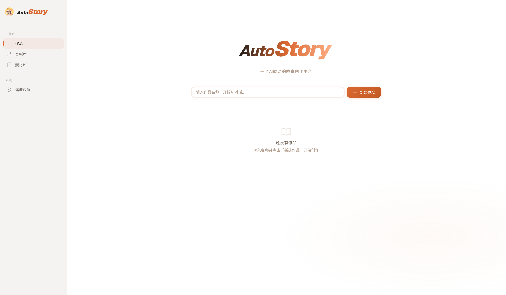
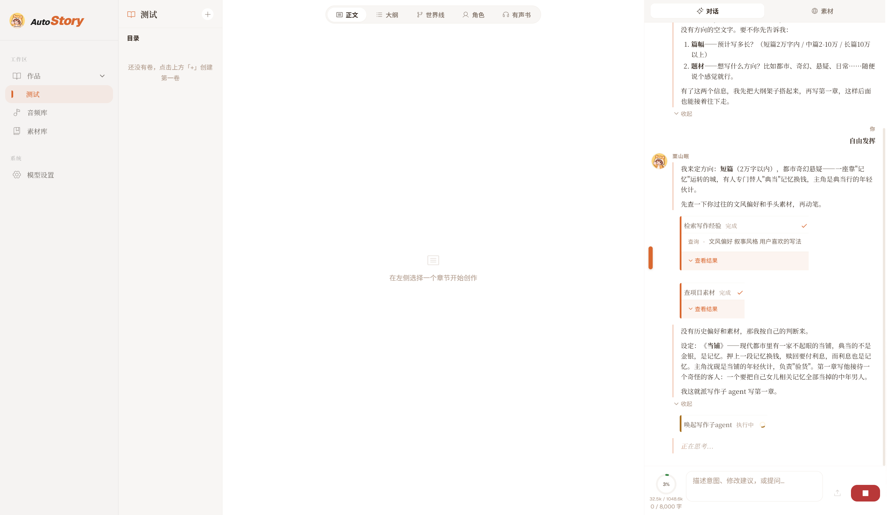
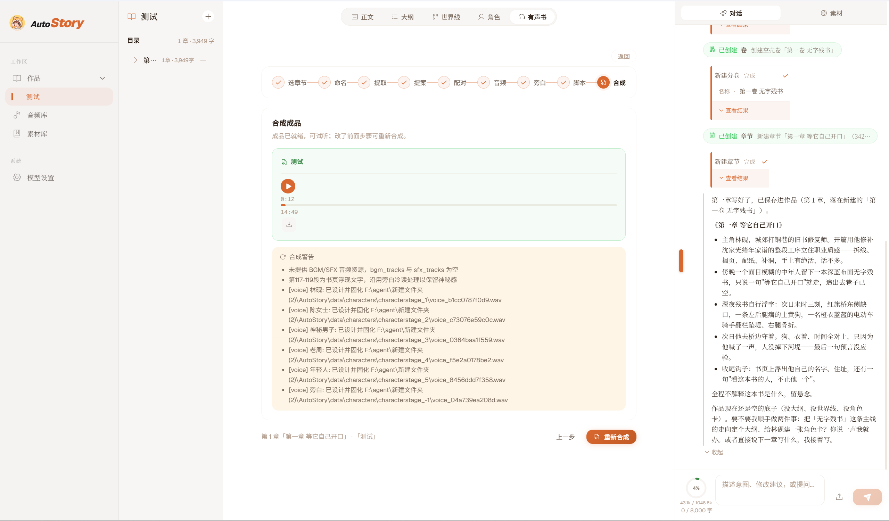

<div align="center">
  

<h1>AutoStory</h1>

<p>小说创作桌面应用</p>
</div>

<p align="center">
  
  <a href="https://github.com/ZLKZCC/AutoStory">
    
  </a>
  
  
  
</p>

---

## 项目背景

AutoStory 是一个用于写作的AI桌面应用，主要面向长篇小说创作。你可以同时创建多个作品，每个作品里除了具体的章节正文外，还包含了用于管理分卷、章节、大纲、世界线、角色设定的工作台。

写的时候可以让 AI 帮忙起草或修改这些内容；本应用还接入了 Qwen3-TTS，所以章节创作完成之后，还可以将指定的章节转换为有声音频。

<p align="center">
  
</p>
<p align="center">
  
</p>
<p align="center">
  
</p>

<details open>
<summary><strong>🎧 有声书试听——点击收起/展开全文</strong></summary>
[AutoStory 有声书音频示例]
<table>
<tr>
<td>

https://raw.githubusercontent.com/ZLKZCC/AutoStory/refs/heads/main/audiobook-sample.mp4

</td>
</tr>
</table>


*↑ 音频由 AutoStory 有声书流程合成（多角色音色 + 旁白）。若播放器未显示，[点此在浏览器中收听](audiobook-sample.mp3)。*

---

打铜巷早上有股铁腥味。

巷子窄，两边是矮房，屋檐快碰在一起。从前这里打铜器，一溜十几家炉子，如今剩三家五金铺、一个修鞋摊、一家卖早点。林砚的铺子在巷子中段，门脸一米八宽，木门上挂块旧匾，漆掉了大半，剩三个字能认：拾遗斋。

他六点起，烧水，擦台面。台面是块老榆木，被糨糊和手汗浸出一层暗光。窗边斜进来一道光，落在他手背上，能看见灰在里头浮。

今天修的是沈家的家谱，四册，昨天下午陈女士送来的。她五十来岁，戴副金边眼镜，进门先看了一圈墙上挂的裱好的字，才把布包放到台面上。

"我外公留下的。"她说，"箱底压了三十年。前阵子梅雨，返潮。"

林砚把册页摊开。棉纸，竹纸，混着用，光绪年的东西。霉斑成片，边角发黑。第三册后半，虫蛀了七八个洞，最大的一个穿过三行字，正咬在名字上。

"能修。"他说。

"修好要紧吗？我是说——"她顿了一下，"值多少钱？"

林砚没接这句。他把册子翻到最后一页，指给她看："这里缺一册。你家里还有没有？"

"没有了。"她说，"我外公那辈兄弟三个，分家时分了。到我手上就这四本。"

她走了以后，林砚开始拆书。

锥子尖挑进线孔，一点一点把旧线挑出来。线是白棉线，脆了，一扯就断。他挑得很慢，怕带起纸。四册拆完，线放在小碟里，回头要照着原样订回去。

揭页最费工夫。册页粘得紧，他拿竹起子从书口伸进去，贴着纸背，一点一点往里推。竹起子是他自己削的，一头磨薄，像指甲盖。推半寸，停一下，听听有没有撕响。

补洞先配纸。他从一摞旧纸里翻，翻出一张颜色相近的竹纸，对着窗光照，帘纹差不多宽。配纸宁浅勿深，深了补上去就是一块疤。

他把纸按在洞上比，用手指把边缘撕出毛边——不能剪，剪的边太齐，一补就显。撕好的补纸蘸糨糊，毛笔尖点四下，轻轻覆上去，垫吸水纸，棕刷一压。压完的纸面平了，只剩一圈水痕，干了就看不出来。

中午他煮了碗面，站着吃。修鞋摊的老周在对面喊他下棋，他摇头。吃完接着补第二个洞。

糨糊在他指缝里干了，起了一层薄皮。他搓掉，接着干。

到傍晚，第二册补完一半。他把册页按顺序码好，压上石板，去里间洗手。

铺子后面用一块蓝布帘隔开，一张单人床，一张桌，一个电磁炉，一个铁皮柜。他一个人住。父母走得早，他没别的亲戚。铺子是他师父留下的，师父也走了六年了。

他洗完手出来，天已经暗了。巷子里的灯一盏一盏亮起来。他正要把门板拉上一半，门帘响了一声。

一个人站在门口。

中年，男的。穿一件旧夹克，肘部磨白了，什么颜色说不好，灰的或者蓝的。个子中等。林砚后来回想的时候，只记得这些——脸，他记不起来。不是忘了，是当时就没看住。像看了一样东西，眼睛一滑就过去了。

那人手里一个布包，用旧蓝布裹着，放在台面上。

"修不修？"林砚问。

那人把布解开。里面是一本书。

开本不大，比手掌长一点。深蓝布面封皮，没有书名，没有题签。布面磨得发亮，四角包过，包角用的不是纸，是皮，什么皮看不出来。林砚伸手翻了两页。

纸极老。泛黄，发脆，纤维粗，帘纹比寻常竹纸宽。边缘有虫蛀，虫屎是黑的，一撮一撮。他对着灯翻了一遍，从头翻到尾。

一页字也没有。

"这书没字。"他说。

"有。"那人说。

"哪一页？"

"等它自己开口。"

林砚抬头。他想问这是什么意思，想问这书哪来的，想问留个姓名、留个电话。

那人已经转身了。

"你等等。"林砚说，"留个名字。"

那人往外走，脚步不快。走到巷子里，背影像被灯影吃了一块。林砚追出门两步。巷子里只有老周在收摊，还有一辆收废品的三轮车推过去，车斗里铁皮哐当响。

他回头再看那人站过的地方，门口空着。

他把书拿起来，翻到第一页。还是白的。他又翻到中间。白。翻到最后。白。

布包还在台面上，他把布抖开，什么也没有。

那天夜里他睡得晚。十一点多，他把补好的册页翻了一遍，检查糨糊干了没有，然后坐到桌前，把那本深蓝封皮的书摊开。

台灯是老式的，灯罩发黄，光聚在桌面上一个圆。

他先看装帧。线装，但不是四眼订，是六眼，孔位偏里，线走法古怪，像是从书脑那边起的。他拆过上千本旧书，这种订法没见过。翻到书脊，没有书名，也没有藏印、没有批注、没有藏书票。

他拿起来透光看。纸里没有夹层。他闻了闻，旧纸味，樟脑味，还有一点说不清的，像雨后墙根的味道。

十二点过了。他看累了，合上书，去洗脸。

回来的时候，书还摊在桌上。

第一页上有东西。

淡，很淡，像水痕。他以为是灯照出来的，把灯罩转了转。不是。那东西在变。一点一点，从纸背渗上来，墨色由浅到深，像浸了水的棉线在往上爬。

他坐下了。

字一行一行出来。工整，端正，不是手写体，也不是铅印。笔锋都在，但每一笔都一样粗细。

他看了很久，才去看写的什么。

"明日，未时三刻前后，红旗桥东侧桥栏缺口处，一条土黄色狗自桥西窜上桥面，左后腿瘸。"

"一男子骑电动车自南向北，橙衣，蓝盔，为避此狗，连人带车翻出桥栏缺口，坠于河堤。男子右腿骨折。"

"狗离去。无人拦阻。"

字到这里停了。

林砚坐在那儿，手还搭在书页边上。

他站起来，走到门口，拉开门看了一眼巷子。巷子里没人。老周家的灯灭了。他回来把门闩上，又检查了一遍后窗。

他找了张补纸，拿铅笔把这几行字抄下来。抄完，对着台灯又读了一遍。

未时三刻，下午一点四十五前后。红旗桥，他知道，在城东，过两条街，桥栏东侧前年被一辆货车撞坏过一段，一直没修，用两根钢管横着拦。

他把书翻到第二页，白。第三页，白。翻到最后，白。

他把书合上，放进铁皮柜，锁了。

后半夜他醒了一次，开灯看了一眼柜子。锁是好的。

第二天上午他接着补沈家的家谱。手上活儿没停，糨糊点得比平时多。中午他没吃饭。

一点出头，他锁了铺子门。

纸条叠成四折，在裤兜里。

走到红旗桥用了二十分钟。桥不长，四十来米，横在一条排污河上。河水发绿，河堤是水泥的，坡上长着草，草不高。桥栏是水泥栏杆，东侧中间确实缺了一截，两根钢管横着，下面有空隙，能钻人。

他到的时候一点半。桥面上来往的车不多。他站在桥东侧，靠着栏杆，看桥西。

一点四十。一只麻雀落在钢管上。

一点四十三。桥西头的巷口有个人推着板车出来，卖菜的，过去了。

一点四十五。

桥西，一条黄狗窜上桥面。

土黄色，跑起来右后腿使不上劲，左后腿瘸。它贴着栏杆跑，往东。

桥南，一辆电动车过来。骑车的是个年轻人，橙色工装，蓝头盔，车后架上绑着一个方箱子。

林砚往前迈了两步，喊了一声："慢点——"

年轻人扭头看他。

车头偏了一下。狗从车前一尺的地方窜过去。电动车撞上桥栏，前轮卡进两根钢管之间的空隙里，车身一歪，人从车座上翻下来，摔在桥面上。

林砚过去扶他。

年轻人坐起来，先摸头盔，再摸腿。手肘蹭掉一块皮，血珠往外冒。右腿膝盖那块，裤子上磨出个洞，破皮一大片。他把车从钢管里拽出来，前轮歪了，转不动。

"你喊我干什么？"他说。

"有狗。"林砚说。

"狗在哪？"

狗已经跑没影了。

年轻人骂了一句，扶着车推了两步，又回头说了句"谢了"，一瘸一拐推着车往北去了。

林砚站在缺口边，往下看。

河堤在三四米下面。坡上的草被踩过一条印，是别人下河钓鱼踩的。他看了一会儿，把那两根钢管用手推了推，晃。

他从兜里掏出纸条，展开。

土黄色狗，左后腿瘸。橙衣，蓝盔。为避此狗，翻出桥栏缺口，坠于河堤，右腿骨折。

狗对上了。衣服对上了。时间对上了。

只有最后一截，没对上。人没掉下去。

他把纸条折回去，塞进兜里，往回走。

回到铺子天快黑了。他拉开门，没开大灯，只开了台灯。铁皮柜打开，书还在原处。

他把书拿到台面上，翻开第一页。

昨天那几行字还在。工整，端正，墨色已经沉下去，像印上去很久了。

他往后翻。第二页，白。第三页，白。

他把手按在书页上，准备合上。

指尖下面有东西。

他停住。移开手。

第二页上，纸背下面有墨色在浮。一行，两行。比昨天慢，一笔一笔渗上来。

"林砚。"

"城郊打铜巷十七号。"

"今日午后，他去过红旗桥，改动了一件事。"

他盯着这几行字，一动不动。

下面的纸面还在动。第三行末尾空着的地方，墨色正在往上爬，比上面几行更淡，像还没浸透。

"看这本书的人，不止他一个。"

台灯的光罩在桌面上一个圆里。屋里只有他一个人。窗外巷子里，老周在收摊，铁架子磕在地上，响了一声。

</details>

项目目前还处于初期，很多地方还待打磨。

## 技术架构

| 层                 | 技术栈                                                 | 主要用途                            |
| ----------------- | --------------------------------------------------- | ------------------------------- |
| 桌面壳 `src-tauri/`  | Tauri 2 · Rust                                      | 窗口、前端加载、后端进程生命周期管理              |
| 前端 `frontend/`    | Vue 3（TSX 风格）· Vite 6 · Pinia · vue-router          | 页面和交互、SSE 对话流、有声书向导、可视化工作台      |
| 后端 `backend/`     | FastAPI · LangGraph · SQLAlchemy (async) · ChromaDB | 作品、卷、章节、角色等资源管理 + Agent 编排、向量检索 |
| 模型 `data/models/` | bge-m3 · Qwen3-TTS                                  | 本地向量化、语音合成                      |

后端一部分是常规的业务接口，负责作品、卷、章节、角色这些数据的增删改查；另一部分是 LangGraph 编排的 Agent。两边共用同一套数据库。

Agent结构：

```text
context ─▶ think ─┬─▶ act（串行执行全部工具调用）──┐
                  │                              │
                  ├─ 无调用 ─▶ END                │ 正常：直接回 think
                  │                              │
                  └── 超阈值 ─▶ compress ◀────────┘
                          │
                          └─▶ think
```

- context / act 出口共用同一阈值判定：本轮上下文超阈值就先进 compress 压缩历史，再回 think 继续。
- 有声书不再单独走子图：整条管线就是 act 里的一个工具，各步骤与各处人审打包成可恢复的任务（`@task`）——人审在中断处 park，裁决后 resume 续跑，已完成步骤重放时命中缓存。

## 快速开始

### 环境要求

- NVIDIA 显卡，显存 8GB 及以上（Qwen3-TTS 本地语音合成需要）
- Node.js 22+ 与 pnpm
- Python 3.12+
- Rust 工具链（构建桌面版时需要）
- `data/models/` 下的模型文件夹：
  - `bge-m3`
  - `Qwen3-TTS-12Hz-1.7B-Base`
  - `Qwen3-TTS-12Hz-1.7B-CustomVoice`
  - `Qwen3-TTS-12Hz-1.7B-VoiceDesign`
  - `Qwen3-TTS-Tokenizer-12Hz`

缺少模型时，应用将在启动时自动下载。

后端依赖在 `backend/requirements.txt`。

PyTorch 不放在 requirements 里，需要根据本机显卡情况，从 [PyTorch 官网](https://pytorch.org/get-started/locally/) 安装对应的 CUDA / CPU 版本。

桌面应用的打包版本会在第一次启动时自动处理这些依赖，包括自动安装pytorch。

### 启动后端

```bash
cd backend
python main.py
```

默认监听：

```text
http://127.0.0.1:8080
```

### 启动前端

```bash
cd frontend
pnpm install
pnpm dev
```

默认监听：

```text
http://localhost:5173
```

### 启动桌面壳（可选）

从项目根目录运行：

```bash
frontend\node_modules\.bin\tauri.cmd dev
```

Tauri CLI 安装在 `frontend` 的 `devDependencies` 里。

开发模式下后端端口固定为 `8080`，所以需要先手动启动后端。

## 构建

Windows 桌面版目前分两步构建：

1. 用 PyInstaller 打包后端。
2. 用 Tauri 生成 NSIS 安装包。

```bash
cd backend
python -m PyInstaller autostory.spec --noconfirm

cd ..
frontend\node_modules\.bin\tauri.cmd build
```

### 应用目录

```text
应用目录/
├── AutoStory.exe         # 桌面壳，Tauri 生成
├── backend/              # 后端，PyInstaller 产物
│   ├── autostory-backend.exe
│   └── _internal/        # 后端运行环境，不含 PyTorch
├── data/
│   ├── chroma/kb.db/     # 知识库种子（写作相关的一些知识）
│   ├── models/           # 模型文件夹（首次启动自动下载）
│   └── autostory.db 等   # 业务库与生成产物（运行时自生成）
├── runtime/              # 首次启动自动下载安装
│   ├── python/           # Python 运行时（PyTorch 宿主）
│   ├── ffmpeg/
│   └── manifest.json     # 已安装项清单（含 torch 变体）
└── logs/                 # 运行日志（运行时生成）
```

安装包只带桌面壳、后端产物和知识库种子，其余在第一次启动时自动下载：

- Python 运行时
- PyTorch（按显卡自动选 CUDA / CPU 版）
- ffmpeg
- `data/models/` 下的模型文件夹

## 项目结构

```text
AutoStory/
├── src-tauri/            # Tauri 2 桌面壳
│   ├── src/main.rs
│   ├── tauri.conf.json
│   └── icons/
├── frontend/             # Vue 3 + Vite 前端
│   └── src/
│       ├── pages/        # Home / Project / Settings / Resources / KnowledgeBase
│       ├── components/   # 对话气泡、有声书卡片、可视化工作台等
│       ├── api/          # 按业务域拆分的接口封装
│       └── stores/       # Pinia 状态（chat=对话运行态，每项目一份分片）
├── backend/              # FastAPI + LangGraph 后端
│   ├── main.py           # 应用入口
│   ├── autostory.spec    # PyInstaller 打包配置
│   ├── agent/            # 主图、节点、工具、子 Agent、模型适配
│   ├── routers/          # HTTP 路由
│   ├── models/           # ORM 模型
│   ├── schemas/          # 请求 / 响应模型
│   ├── crud/             # 数据访问层
│   ├── utils/            # 上下文构建、运行管理、有声书管线
│   └── config/           # 路径与数据库配置
├── data/                 # 运行时数据（模型、向量库、生成产物）
└── logo.png
```

## 贡献

欢迎提交 Issue 和 Pull Request。

项目还在持续调整中，提交 PR 前建议先确认：

- 后端可以通过编译检查
- 前端可以通过类型检查

GitHub：

https://github.com/ZLKZCC/AutoStory

## 许可证

本项目基于 [Apache License 2.0](https://www.apache.org/licenses/LICENSE-2.0) 发布。
